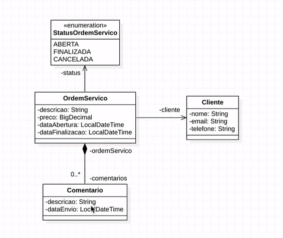

# API-Java
Criação de uma API RESTful com Java e Spring Framework.

Projeto desenvolvido em um curso da Algaworks. 

Usando tecnologias: JPA, Hibernate, Flyway e Jakarta EE.

Durante o desenvolvimento do projeto, foi utilizado alguns conceitos e padrões do Domain-Driven Design (DDD).

Utilizei o padrão DTO(Data transfer object) para realizar a separação entre o Domain Model vs Representation Model.
Com essa separação ficou claro que a regra da API ficou isolada da regra do dominio da aplicação.

Realizei a instalação do ModelMapper atravez da classe pom.xml do Maven. Utilizei o ModelMapper para realizar conversão entre objetos.
Para utilizar o ModelMapper tive que expor para o Spring essa configuração, ou seja tornar o ModelMapper gerenciado pelo Spring.
Anotando uma nova classe com inicialização e estanciamento do ModelMapper como @Configuration e o metodo como @Bean.
@Configuration, para informar ao Spring que é um componente identifivel com esse objetivo especifico de configuração de Bean's.
@Bean, para informar ao Spring que esta classe será disponibilizada para injeção de independencia para outras classes.

Utilizei o Padrão ISO-8601 para Data e Hora.

Modulação

